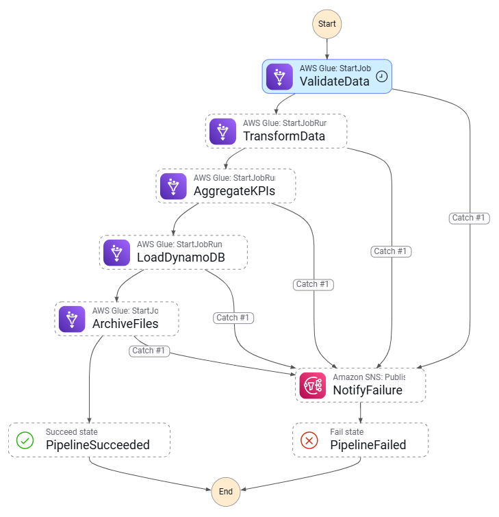

# AWS Step Functions — Orchestrating the Pipeline

## What This Document Covers

This document explains, from the ground up, how **AWS Step Functions** orchestrates the music
streaming pipeline. It is written for a data engineer who is new to cloud orchestration, so it
starts with the fundamentals — what a *state machine* is, what a *state* is, how states *chain*
together — before walking through this project's actual state machine line by line. It then
explains the **Catch** and **Retry** error-handling blocks, and finishes with *why* Step Functions
is used here instead of just running the Glue jobs manually or with a cron script.

Everything maps to the real definition in
[terraform/step_functions.tf](../terraform/step_functions.tf).

---

## 1. The Core Idea — What Is a State Machine?

### Start with the problem

This pipeline has to do several things **in a strict order**, and each step depends on the one
before it:

1. Run a crawler to catalog the raw files.
2. Wait for that crawler to finish.
3. Validate the data.
4. Transform it (Bronze → Silver).
5. Aggregate KPIs (Silver → Gold).
6. Load the results into DynamoDB.
7. Archive the processed files.

If step 4 fails, steps 5–7 must **not** run on garbage data. If the crawler is still running, the
validation job must **wait**, not charge ahead. Somebody — or something — has to be the
"conductor" that knows the order, watches each step, decides what happens next, and reacts when a
step fails.

That conductor is a **state machine**, and AWS Step Functions is the managed service that runs it.

### The definition

A **state machine** is a description of a workflow as a set of **states** (individual steps) and
the **transitions** between them (the arrows that say "after this step, go to that step"). At any
moment the workflow is "in" exactly one state. When a state finishes, the machine moves
("transitions") to the next state. It keeps moving until it reaches an end state — either success
or failure.

Think of it as a flowchart that AWS actually *executes* for you. You describe the boxes and arrows
once (in JSON), and Step Functions runs through them, one box at a time, every time the pipeline
is triggered. Each run is called an **execution**.

### How it is defined in this project

The whole flowchart is written as a single JSON document built with Terraform's `jsonencode`
([step_functions.tf:138](../terraform/step_functions.tf#L138)):

```hcl
locals {
  sfn_definition = jsonencode({
    Comment = "Music Streaming ETL Pipeline — orchestrates 5 Glue jobs in sequence"
    StartAt = "NormalizeInput"
    States  = { ... }     # every step lives in here
  })
}
```

Two top-level keys define the shape of the machine:

- **`StartAt`** — the name of the first state to run. Here it is `"NormalizeInput"`.
- **`States`** — an object containing every state, keyed by name. Each state says what it does and,
  crucially, what comes **`Next`**.

The state machine resource itself is created at
[step_functions.tf:454](../terraform/step_functions.tf#L454):

```hcl
resource "aws_sfn_state_machine" "pipeline" {
  name       = "${var.project_name}-pipeline"
  role_arn   = aws_iam_role.sfn_role.arn
  definition = local.sfn_definition
  type       = "STANDARD"
  ...
}
```

`type = "STANDARD"` is the right choice for an ETL pipeline: STANDARD workflows are durable, can
run for up to a year, log every step, and are billed per state transition. (The alternative,
EXPRESS, is cheaper and faster but is designed for very high-volume, short-lived event processing
— not multi-minute Glue orchestration.)

---

## 2. What a "State" Is — the Building Blocks

Every box in the flowchart is a **state**, and every state has a `Type`. This project uses five of
the standard Step Functions state types. Understanding these five is enough to read the entire
pipeline:

| State `Type` | What it does | Analogy |
|---|---|---|
| **Task** | Does actual work — calls another AWS service (start a Glue job, publish to SNS, list S3 objects) | "Do this thing" |
| **Choice** | Branches: looks at the data and picks the next state based on a condition | "If X then go here, else go there" |
| **Wait** | Pauses for a fixed number of seconds, then continues | "Sleep for 45 seconds" |
| **Pass** | Passes data through, optionally reshaping it, without calling any service | "Tidy up the paperwork" |
| **Succeed / Fail** | Terminal states that end the execution as a success or a failure | "The end (good / bad)" |

### How data flows between states

Each execution carries a single **JSON document** as its state — think of it as a clipboard passed
from one state to the next. A state can read from that clipboard, and write its own result back
onto it. Two fields control this:

- **`ResultPath`** — where on the clipboard to write this state's output. For example
  `ResultPath = "$.crawlerStatus"` means "take what this task returned and store it under the key
  `crawlerStatus`." A later Choice state can then read `$.crawlerStatus.Crawler.State`.
- **`Parameters`** — the input you hand to the service the task calls (e.g. which Glue job name to
  start).

This is exactly why the very first state exists. The pipeline is triggered by an SQS message
arriving through an EventBridge Pipe, and that delivers a messy array as the input. If the machine
tried to write `ResultPath = "$.crawlerStatus"` onto an array, it would crash with
`States.ReferencePathConflict`. So the first state wipes the clipboard clean
([step_functions.tf:150](../terraform/step_functions.tf#L150)):

```hcl
NormalizeInput = {
  Type       = "Pass"
  Parameters = {}          # replace whatever came in with a clean empty object {}
  Next       = "CheckAlreadyRunning"
}
```

A `Pass` state that sets `Parameters = {}` throws away the raw SQS envelope and hands the rest of
the machine a clean `{}` object to write into. Small, but essential.

---

## 3. How States Chain Together

States chain through the **`Next`** field. State A says `Next = "B"`, so when A finishes, the
machine moves to B. B says `Next = "C"`, and so on, until a state has no `Next` because it is a
terminal `Succeed` or `Fail`.

Here is the full chain of this pipeline, in order
([step_functions.tf:3](../terraform/step_functions.tf#L3) documents it as a comment):

```
NormalizeInput (Pass)
   → CheckAlreadyRunning (Task: list running executions)
   → IsAnotherRunning (Choice)
        ├─ another run active → WaitForPreviousRun (Wait 60s) → back to CheckAlreadyRunning
        └─ clear → StartRawCrawler (Task: start Glue crawler)
   → WaitForCrawler (Wait 45s)
   → CheckCrawlerStatus (Task: get crawler state)
   → IsCrawlerReady (Choice)
        ├─ state != READY → back to WaitForCrawler   (polling loop)
        └─ state == READY → CheckStreamsExist (Task: list S3 streams/)
   → AreThereStreams (Choice)
        ├─ no files → NoStreamsToProcess (Succeed)   (clean exit)
        └─ files exist → ValidateData (Task: Glue job)
   → TransformData (Task: Glue job)
   → AggregateKPIs (Task: Glue job)
   → LoadDynamoDB (Task: Glue job)
   → StartCuratedCrawler (Task: start Glue crawler — non-fatal)
   → ArchiveFiles (Task: Glue job)
   → PipelineSucceeded (Succeed)
```

Here is the same machine as the Step Functions console actually renders it — every box is one
state, and every arrow is a `Next` (or a `Catch`) transition. This is the visual equivalent of the
ASCII chain above:

.png>)

Reading the graph top to bottom you can see all three structural features at a glance: the
**concurrency guard** at the top (`CheckAlreadyRunning` ⇄ `WaitForPreviousRun`), the **crawler
polling loop** in the middle (`WaitForCrawler` ⇄ `CheckCrawlerStatus` ⇄ `IsCrawlerReady`), the
**streams existence branch** (`AreThereStreams` → `NoStreamsToProcess` for the clean exit), and the
long sequential spine of Glue jobs, each with a dotted `Catch` arrow peeling off to the right toward
`NotifyFailure`.

Notice three patterns that are worth calling out, because they are what make this more than a
straight line:

### Pattern A — A polling loop (Wait + Choice)

Crawlers and jobs don't finish instantly, and a `Task` that *starts* a crawler returns immediately
— it does not wait for the crawler to be done. To wait, the machine **loops**:

```
WaitForCrawler (Wait 45s) → CheckCrawlerStatus (Task) → IsCrawlerReady (Choice)
        └─ not READY yet → go back to WaitForCrawler
```

`IsCrawlerReady` ([step_functions.tf:256](../terraform/step_functions.tf#L256)) inspects the
crawler state the previous task wrote to the clipboard:

```hcl
IsCrawlerReady = {
  Type = "Choice"
  Choices = [{
    Variable     = "$.crawlerStatus.Crawler.State"
    StringEquals = "READY"
    Next         = "CheckStreamsExist"
  }]
  Default = "WaitForCrawler"     # still running → wait another 45s and re-check
}
```

This "wait, check, branch back if not done" cycle is the standard Step Functions way to wait for a
long-running asynchronous job — without paying for a server to sit and poll.

### Pattern B — A concurrency guard

Multiple files can be uploaded at once, each triggering an execution. Running two full pipelines
simultaneously would waste compute and could corrupt the Silver/Gold data. So before doing any
work, the machine asks "is another execution of me already running?"
([step_functions.tf:171](../terraform/step_functions.tf#L171)):

```hcl
CheckAlreadyRunning = {
  Type     = "Task"
  Resource = "arn:aws:states:::aws-sdk:sfn:listExecutions"
  Parameters = { StatusFilter = "RUNNING", MaxResults = 2, ... }
  ResultPath = "$.runningCheck"
  Next       = "IsAnotherRunning"
}
```

If a second running execution exists, `IsAnotherRunning` sends this one to `WaitForPreviousRun`
(a 60-second `Wait`) and then loops back to re-check. The newer execution politely yields until
the older one finishes, then proceeds — so every uploaded file still gets processed, just in one
orderly run rather than several colliding ones.

### Pattern C — An early clean exit

After the crawler runs, the machine checks S3 directly for actual files under `streams/`
([step_functions.tf:286](../terraform/step_functions.tf#L286)). If there are none,
`AreThereStreams` routes to `NoStreamsToProcess`, a `Succeed` state. This matters: it ends the run
*successfully* (not as a failure) so the failure alarm doesn't fire a false alert when there
simply was nothing new to process.

---

## 4. How a Task Actually Calls Another Service

The `Resource` field of a `Task` state tells Step Functions *which* service action to call. This
project uses two important forms:

### `.sync` — wait for the Glue job to finish

Every Glue job is started like this ([step_functions.tf:324](../terraform/step_functions.tf#L324)):

```hcl
ValidateData = {
  Type     = "Task"
  Resource = "arn:aws:states:::glue:startJobRun.sync"
  Parameters = { JobName = aws_glue_job.validation.name }
  ResultPath = "$.validationResult"
  Next       = "TransformData"
  Catch      = [ ... ]
}
```

The `.sync` suffix is the key. It tells Step Functions: **start the Glue job and do not move to the
next state until that job actually completes.** Without `.sync`, the machine would fire the job and
immediately rush to the next state, loading DynamoDB before the data was even transformed.
`.sync` is what makes the steps truly sequential and dependent.

### AWS SDK integrations — call any API directly

States like `CheckAlreadyRunning`, `StartRawCrawler`, and `CheckStreamsExist` use the
`arn:aws:states:::aws-sdk:<service>:<action>` form (e.g. `aws-sdk:s3:listObjectsV2`). This lets the
state machine call almost any AWS API directly, with no Lambda function in between — Step Functions
makes the SDK call itself. That is how the pipeline lists S3 objects and reads crawler status
without writing or hosting a single line of glue code.

---

## 5. Error Handling — `Catch` and `Retry`

This is where Step Functions earns its place. In a manual or scripted pipeline, a failure halfway
through leaves you with half-finished work and no automatic notification. Step Functions gives
every state two built-in, declarative safety mechanisms: **Retry** and **Catch**.

### Retry — try again before giving up

A **`Retry`** block says "if this state fails with a certain kind of error, wait and try again
automatically, up to N times." It is ideal for **transient** failures — a brief network blip, a
throttling response, a service that is momentarily busy. The general shape is:

```hcl
Retry = [{
  ErrorEquals     = ["States.ALL"]   # which errors to retry on
  IntervalSeconds = 10               # wait before first retry
  MaxAttempts     = 3                # try up to 3 times
  BackoffRate     = 2.0              # double the wait each time (10s, 20s, 40s)
}]
```

> **A note specific to this project:** the state machine in
> [step_functions.tf](../terraform/step_functions.tf) does **not** declare `Retry` blocks on its
> states — it relies on `Catch` for a fail-fast strategy (explained below). Retry logic *does*
> exist in the pipeline, but it lives in two other places that are better suited to it:
> - The **crawler polling loop** (Wait + Choice in Pattern A) is effectively a hand-built retry
>   loop for "is the crawler done yet?".
> - The **validation Glue job** itself retries `TableNotFound` with exponential backoff in Python
>   (see [Glue_Crawlers_and_Jobs.md](Glue_Crawlers_and_Jobs.md)).
>
> The `Retry` block is described here so you understand the mechanism and could add it — for
> example, wrapping each `startJobRun.sync` in a `Retry` on `States.TaskFailed` would auto-retry a
> Glue job that failed for a transient reason before declaring the whole pipeline failed.

### Catch — when a step truly fails, route somewhere safe

A **`Catch`** block says "if this state fails, *don't* crash the whole execution with a raw stack
trace — instead jump to a named recovery state." Every working step in this pipeline has the same
Catch ([step_functions.tf:332](../terraform/step_functions.tf#L332)):

```hcl
Catch = [{
  ErrorEquals = ["States.ALL"]    # catch any error
  ResultPath  = "$.error"          # save the error details onto the clipboard
  Next        = "NotifyFailure"    # then jump to the failure-notification state
}]
```

Read in plain English: *"If this Glue job fails for any reason, store the error under `$.error` and
go to `NotifyFailure`."* Because **every** task points its Catch at the same `NotifyFailure` state,
a failure anywhere in the pipeline converges on a single, consistent failure path. This is what
guarantees that a failure at step 4 cleanly stops steps 5–7 instead of running them on bad data.

The graph below focuses on just the Glue-job spine and makes this convergence visual — notice how
each state (`ValidateData`, `TransformData`, `AggregateKPIs`, `LoadDynamoDB`, `ArchiveFiles`) has a
`Catch #1` arrow, and **all of them funnel into the single `NotifyFailure` (Amazon SNS: Publish)
state**, which then ends at `PipelineFailed`. The happy path instead flows straight down to
`PipelineSucceeded`:



### Catch with a more specific error — graceful handling

Catch blocks are evaluated in order and can match **specific** error types, not just `States.ALL`.
The crawler start uses this to treat "already running" as harmless
([step_functions.tf:220](../terraform/step_functions.tf#L220)):

```hcl
Catch = [
  {
    ErrorEquals = ["Glue.CrawlerRunningException"]   # specific, expected error
    ResultPath  = null
    Next        = "WaitForCrawler"                   # not a failure — just go poll
  },
  {
    ErrorEquals = ["States.ALL"]                     # anything else
    ResultPath  = "$.error"
    Next        = "NotifyFailure"                     # real failure → notify
  }
]
```

If the crawler was already running, that's fine — skip straight to polling. Any *other* error is a
genuine failure and is routed to `NotifyFailure`. Ordering matters: the specific catch is listed
first, the catch-all last.

### A deliberately non-fatal step

Not every failure should stop the pipeline. The curated crawler (which refreshes Athena partitions)
is *nice to have* but not essential, so **all** of its catches route forward to `ArchiveFiles`
rather than to `NotifyFailure` ([step_functions.tf:387](../terraform/step_functions.tf#L387)):

```hcl
StartCuratedCrawler = {
  ...
  Catch = [
    { ErrorEquals = ["Glue.CrawlerRunningException"], Next = "ArchiveFiles" },
    { ErrorEquals = ["States.ALL"],                   Next = "ArchiveFiles" }   # even on error, continue
  ]
}
```

The comment says it plainly: *"Failure here is non-fatal — Athena queries will just miss the latest
partition until the next run."* This shows error handling is a **design choice per step**, not a
blanket rule.

### The failure path itself

When any Catch routes to `NotifyFailure`, that state publishes a formatted message to SNS — which
fans out to Slack and email — then transitions to `PipelineFailed`, a terminal `Fail` state
([step_functions.tf:426](../terraform/step_functions.tf#L426)):

```hcl
NotifyFailure = {
  Type     = "Task"
  Resource = "arn:aws:states:::sns:publish"
  Parameters = {
    TopicArn    = aws_sns_topic.pipeline_alerts.arn
    Subject     = "❌ Music Streaming Pipeline FAILED"
    "Message.$" = "States.Format('PIPELINE FAILED\n\nError: {}\nCause: {}\n...', $.error.Error, $.error.Cause)"
  }
  Next = "PipelineFailed"
}

PipelineFailed = { Type = "Fail", Error = "PipelineError", Cause = "..." }
```

`States.Format(...)` injects the captured `$.error.Error` and `$.error.Cause` into a human-readable
message with direct console links — so the alert tells you *what* broke and *where to look*, not
just *that* something broke.

---

## 6. Why Step Functions Instead of Running Jobs Manually?

A fair question: the five Glue jobs already exist, and there is even a Glue Workflow that can chain
them. Why add a whole state machine? Here is what manual or naïve execution cannot give you that
Step Functions gives this project for free:

### 1. Guaranteed ordering with real dependency waits
Running jobs manually means *you* have to start job 2 only after job 1 finishes, and watch each
one. The `.sync` integration makes the machine wait for each Glue job to truly complete before
starting the next — automatically, every time, with no human watching a console.

### 2. Conditional logic, not just a straight line
A manual run or a simple cron script runs the same steps regardless of context. The state machine
*branches*: it skips everything if there are no new files (`AreThereStreams`), waits if another run
is active (`IsAnotherRunning`), and polls until the crawler is ready (`IsCrawlerReady`). That
decision-making is impossible to express as "just run these five scripts."

### 3. Centralized, consistent error handling
Manually, a failure in step 3 might leave steps 4–5 to run on incomplete data, and you'd only find
out by noticing wrong numbers later. Here, every step's `Catch` stops the pipeline at the point of
failure and fires one consistent alert. You cannot accidentally process bad data downstream.

### 4. Visibility and auditability
Every execution is logged step-by-step to CloudWatch (`level = ALL`,
[step_functions.tf:460](../terraform/step_functions.tf#L460)) with full input/output data, plus an
X-Ray trace. The console draws the flowchart and highlights exactly which box turned red. A manual
script gives you, at best, scattered log lines.

### 5. Event-driven and hands-off
The machine is started automatically by an S3 upload (via EventBridge → SQS → Pipe → Step
Functions). No one has to remember to run anything. Files arrive, the pipeline runs, results land
in DynamoDB, and a human is told only if something breaks or when it succeeds.

### 6. No servers to babysit
Step Functions is fully managed and serverless. The polling loops, waits, and retries cost
fractions of a cent in state transitions — there is no EC2 instance or always-on scheduler sitting
idle between runs.

### Step Functions vs the Glue Workflow (both exist here)
This project also defines a Glue Workflow that chains the jobs ([glue_jobs.tf](../terraform/glue_jobs.tf)).
The difference: the **Glue Workflow** can only chain Glue jobs/crawlers with simple
success-conditional triggers. The **Step Functions state machine** can additionally talk to *any*
AWS service (SQS, SNS, S3, the Step Functions API itself), make data-driven `Choice` branches,
wait and poll, guard against concurrency, and send rich failure notifications. Step Functions is
the primary, event-triggered orchestrator; the Glue Workflow is a simpler on-demand fallback.

---

## 7. Summary

| Concept | In this project |
|---|---|
| **State machine** | A JSON-defined flowchart (`sfn_definition`) that Step Functions executes; `type = STANDARD` |
| **State** | A single step; types used: Task, Choice, Wait, Pass, Succeed, Fail |
| **Chaining** | States link via `Next`; data passes on a JSON "clipboard" via `ResultPath` |
| **Task `.sync`** | `glue:startJobRun.sync` waits for each Glue job to finish before continuing |
| **Choice** | Branches on clipboard data — concurrency guard, crawler-ready check, streams-exist check |
| **Wait + Choice loop** | Polls the crawler every 45s until `READY` |
| **Catch** | Every step catches errors → saves them to `$.error` → routes to `NotifyFailure` (or forward, for non-fatal steps) |
| **Retry** | Mechanism explained; this pipeline implements equivalent retry via the polling loop and in-job backoff |
| **Failure path** | `NotifyFailure` (SNS publish) → `PipelineFailed` (Fail) |
| **Why over manual** | Guaranteed ordering, conditional logic, consistent error handling, full visibility, event-driven, serverless |

The state machine is the brain of the pipeline: it knows the order, waits for each step, decides
what to do based on live conditions, stops cleanly on failure, and tells a human what happened —
all without anyone running a command by hand.
